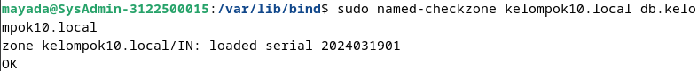
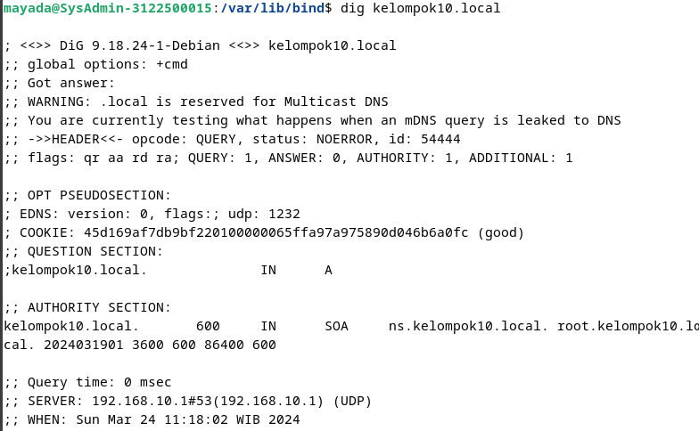

<h1 align="center">LAPORAN WORKSHOP ADMINISTRASI JARINGAN</h1>

<h3 align="center">Dosen Pembimbing: Dr. Ferry Astika Saputra ST, M.Sc</h3>

<p align="center"></p>

<div align="center">
  <h3>Disusun Oleh:</h3>
  <p align="center">Masyitha Fahra Nabila 3122500023</p>
</div>

<div align="center">
  <h3>PROGRAM STUDI TEKNIK INFORMATIKA <br>
      POLITEKNIK ELEKTRONIKA NEGERI SURABAYA <br>
      TAHUN 2023/2024 <br>
  </h3>
</div>

---
Daftar Isi
- [Soal 1 (Ekosistem Internet)](#1-ekosistem-internet)
- [Soal 2 (DNS Query)] (#2-dns-query)
- [Soal 3 (BIND9)] (#3-instalasi-dns-server)

---

## 1. Ekosistem Internet

<div align="center">
    <br>
    <em style="font-size:10px">Sumber: https://www.internetsociety.org/wp-content/uploads/2017/09/factsheet_ecosystem.pdf</em>
</div><br>

<div align="justify">
<span style="font-size:14px">
Ekosistem Internet adalah jaringan organisasi dan komunitas yang membantu internet berfungsi dan berkembang. Internet sukses dan berkembang karena nilai-nilai bersama. Ekosistem Internet terus tumbuh secara dramatis di lingkungan yang subur dengan permintaan pengguna. Sebagian besar pertumbuhan berasal dari aplikasi yang sensitif terhadap kualitas. Spesies ekosistem Internet yang dominan adalah penyedia konten, penyedia akses, dan penyedia transit. 

<br/><br/>
Elemen-elemen:
- <b>County-Code Top-Level Domains (ccTLDs):</b> Beroperasi sesuai dengan kebijakan lokal yang disesuaikan dengan negara atau wilayah masing-masing.
- <b>Generic Top-Level Domains (gTLDs):</b> Mengoperasikan domain tingkat atas generik yang disponsori dan tidak disponsori sesuai dengan kebijakan ICANN.
- <b>Governments and Governmental Regional Organizations:</b> Menetapkan kebijakan terkait penyebaran dan penggunaan internet, terkadang mengoordinasikan kebijakan secara regional.
- <b>Internet Architecture Board (IAB):</b> Bertanggung jawab atas pengawasan arsitektur aktivitas IETF, pengawasan proses standar internet, dan pengelolaan registrasi parameter protokol IETF.
- <b>Internet Assigned Numbers Authority (IANA):</b> Mengkoordinasikan Root Sistem Nama Domain (DNS) global, pengalamatan Protokol Internet (IP), dan sumber daya protokol internet lainnya.
- <b>Internet Corporation for Assigned Names and Numbers (ICANN):</b> Mengkoordinasikan nama dan nomor unik untuk menjaga internet tetap aman, stabil, dan dapat dioperasikan, serta mengembangkan kebijakan mengenai pengidentifikasi unik internet.
- <b>Internet Engineering Task Force (IETF):</b> Komunitas internasional yang besar dan terbuka yang peduli dengan evolusi dan pengoperasian internet, dengan fokus pada arsitektur internet.
- <b>Internet Community Organizations and Businesses:</b> Mendorong, melatih, dan berinvestasi dalam pendidikan internet dan peningkatan kapasitas.
- <b>Internet Research Task Force (IRTF):</b> Mempromosikan penelitian terkait protokol internet, aplikasi, arsitektur, dan teknologi.
- <b>Internet Society (ISOC): </b> Mempromosikan evolusi dan pertumbuhan internet global dan beroperasi melalui anggota, cabang, dan mitra.
- <b>Internet Exchange Points (IXP):</b> Menyediakan infrastruktur fisik bagi operator jaringan untuk bertukar lalu lintas internet.
- <b>Multilateral Institutions and Development Agencies:</b> Menangani permasalahan internet untuk pengembangan kebijakan, pendidikan, dan peningkatan kapasitas, yang melibatkan banyak negara.
- <b>Network Operators:</b> Menyediakan akses ke internet dan berkolaborasi melalui grup operator jaringan regional.
- <b>Other Policy Discussion Forums:</b> Sertakan forum seperti Internet Governance Forum (IGF) dan Organization for Economic Co-operation and Development (OECD).
- <b>Regional Internet Registries (RIRs):</b> Mengawasi alokasi dan registrasi sumber daya nomor internet di wilayah tertentu.
- <b>Root Servers:</b> Publikasikan file zona root DNS ke internet, membentuk puncak database terdistribusi hierarki yang digunakan oleh aplikasi internet.
- <b>Service Creators/Vendors:</b> Menyediakan aplikasi dan pengalaman perangkat lunak yang memanfaatkan internet.
- <b>Specialized Standards Bodies:</b> Fokus pada standar khusus, yang memainkan peran penting dalam pengembangan internet.
- <b>Universities and Academic Institutions:</b> Mendidik siswa dan membuat prototipe solusi perangkat keras dan perangkat lunak yang memanfaatkan internet.
- <b>Users:</b> Individu dan organisasi yang menggunakan internet atau menyediakan layanan melalui internet.
- <b>World Wide Web Consortium (W3C):</b> Mengembangkan standar web bekerja sama dengan organisasi anggota dan masyarakat.
</span>
</div>

---

### IP Addressing & Routing System
- <b>IP Address</b> adalah deretan angka yang mewakili identitas perangkat ketika terhubung ke internet atau infrastruktur jaringan lainnya. Sama seperti nomor pada alamat rumah, IP Address berfungsi untuk memastikan data dikirim ke perangkat yang tepat.
- <b>Routing</b> adalah proses perpindahan paket data dari satu jaringan ke jaringan lain untuk mencapai tujuan akhirnya. Hal ini mirip dengan pekerja pos yang memilah surat ke dalam tumpukan berbeda berdasarkan alamat pengiriman. Satu-satunya perbedaan adalah bahwa dalam kasus ini, ‘surat’ adalah data digital dan ‘alamat’ adalah alamat IP.
### Peering Connections:
Peering adalah metode yang memungkinkan dua jaringan untuk menghubungkan dan bertukar lalu lintas secara langsung tanpa harus membayar pihak ketiga untuk membawa lalu lintas melalui Internet.
Peering
dibutuhkan oleh kebijakan
memahami:
- Penyedia/Pelanggan
- Transit
- Bebas Penyelesaian

### Route Policy:
Route policy diwujudkan dalam peta rute, yang digunakan untuk mencocokkan rute tujuan berdasarkan alamat IP dan parameter lainnya. Pernyataan set opsional memungkinkan perubahan properti rute tergantung pada kecocokannya. Penggunaan umum kebijakan rute mencakup pemfilteran dan redistribusi rute.

---
### Domain Name System (DNS)
Server DNS adalah komputer dengan database yang berisi alamat IP publik yang terkait dengan nama situs web yang dituju oleh alamat IP tersebut. DNS bertindak seperti buku telepon untuk internet. Setiap kali orang mengetikkan nama domain, seperti Fortinet.com atau Yahoo.com, ke bilah alamat browser web, DNS akan menemukan alamat IP yang benar. Alamat IP situs inilah yang mengarahkan perangkat untuk menuju ke tempat yang benar untuk mengakses data situs.


## 2. DNS Query
### Bagaimana cara kerja dari iterative dan recursive dari DNS Query, ada 8 step, dari PC anda! misal akses detik.com

<div align="center">
    <br>
    <em style="font-size:10px">Sumber: cloudflare.com</em>
</div><br>

- Langkah 1: Pengguna mengetik 'example.com' ke dalam browser web dan kueri menyebar ke Internet dan diterima oleh pemecah masalah rekursif DNS.

- Langkah 2: Resolver kemudian menanyakan server nama root DNS (.) dengan metode **recursive DNS query**.
    - Dalam metode rekursif, resolver DNS pengguna meminta server DNS untuk menemukan jawaban untuknya secara penuh.
    - Server nama root DNS, jika dikonfigurasi untuk mendukung kueri rekursif, akan mengambil tanggung jawab untuk menemukan jawaban yang tepat.

- Langkah 3: Server root kemudian merespons pemecah masalah dengan alamat server DNS Top Level Domain (TLD) (seperti .com atau .net), yang menyimpan informasi untuk domainnya. Saat menelusuri example.com, permintaan kami diarahkan ke TLD .com dengan metode **recursive DNS query**.
    - Server nama root DNS akan mencari informasi tentang TLD (.com, .net, dll.) secara penuh dan memberikan jawaban lengkap kepada resolver DNS pengguna.

- Langkah 4: Resolver kemudian membuat permintaan ke TLD .com dengan metode **iterative DNS query**.
    - Dalam metode iteratif, resolver DNS pengguna membuat permintaan ke server DNS TLD (.com).
    - Server DNS TLD akan memberikan jawaban sebanyak yang dapat diberikan berdasarkan informasi yang dimilikinya.

- Langkah 5: Server TLD kemudian merespons dengan alamat IP server nama domain, example.com, dalam respons yang dikirim kembali ke resolver DNS pengguna.
    - Jika server DNS TLD memiliki informasi tentang domain yang diminta, ia akan memberikan alamat IP yang sesuai sebagai jawaban.

- Langkah 6: Terakhir, penyelesai rekursif mengirimkan kueri ke server nama domain dengan metode **recursive DNS query**.
    - Resolver DNS pengguna, setelah menerima alamat IP dari server DNS TLD, akan mengirimkan kueri ke server nama domain untuk mendapatkan alamat IP yang tepat.

- Langkah 7: Alamat IP misalnya.com kemudian dikembalikan ke penyelesai dari server nama dengan metode **recursive DNS query**.
    - Server nama domain akan merespons kueri rekursif dari resolver DNS pengguna dengan memberikan alamat IP yang benar dari domain example.com.

- Langkah 8: Resolver DNS kemudian merespons browser web dengan alamat IP domain yang diminta pada awalnya.
    - Setelah menerima alamat IP yang benar dari server nama domain, resolver DNS akan memberikan jawaban kepada browser web, memungkinkannya untuk mengarahkan pengguna ke situs web example.com.

Dengan demikian, proses resolusi DNS memungkinkan pengguna untuk mengakses situs web dengan menggunakan nama domain yang mudah diingat, sementara sistem DNS secara efisien menemukan alamat IP yang sesuai dengan nama domain tersebut.


## 3. Instalasi DNS Server
### sumber : https://wiki.debian.org/Bind9#Debian_Bookworm

```
sudo apt install bind9 bind9-doc bind9-dnsutils 
```
<div align="center">
    <br>
    <em style="font-size:10px"></em>
    <em style="font-size:10px">(Sebelumya sudah menginstall lupa di screenshots)</em>
</div><br>

```
cd /etc/bind
ls -al
```
<div align="center">
    <br>
    <em style="font-size:10px"></em>
</div><br>

```
sudo nano /etc/bind/named.conf
```
<div align="center">
    <br>
    <em style="font-size:10px"></em>
</div><br>

```
sudo nano /etc/bind/named.conf.default-zones
```
<div align="center">
    <br>
    <em style="font-size:10px"></em>
</div><br>

```
sudo nano /etc/bind/named.conf.options
```
<div align="center">
    <br>
    <em style="font-size:10px"></em>
</div><br>

```
sudo nano /etc/bind/named.conf.local
```
<div align="center">
    <br>
    <em style="font-size:10px"></em>
</div><br>

```
sudo named-checkconf /etc/bind/named.conf
```
<div align="center">
    <br>
    <em style="font-size:10px"></em>
</div><br>

```
pindah ke : cd /var/lib/bind/
sudo nano db.kelompok11.local
```
<div align="center">
    <br>
    <em style="font-size:10px"></em>
</div><br>

```
sudo named-checkzone kelompok10.local db.kelompok10.local
```
<div align="center">
    <br>
    <em style="font-size:10px"></em>
</div><br>

```
sudo nano db.kelompok10.local.inv
```
<div align="center">
    <br>
    <em style="font-size:10px"></em>
</div><br>

```
sudo named-checkzone 10.168.192.inaddr-arpa db.kelompok10.local.inv
```
<div align="center">
    <br>
    <em style="font-size:10px"></em>
</div><br>

```
sudo nano /etc/network/interfaces
```
<div align="center">
    <br>
    <em style="font-size:10px"></em>
</div><br>

```
sudo nano /etc/resolv.conf
```
<div align="center">
    <br>
    <em style="font-size:10px"></em>
</div><br>

```
sudo systemctl restart named
sudo systemctl status named
```
<div align="center">
    <br>
    <em style="font-size:10px"></em>
</div><br>

```
dig kelompok10.local
```
<div align="center">
    <br>
    <em style="font-size:10px"></em>
</div><br>

```
dig -x 192.168.10.1
```
<div align="center">
    <br>
    <em style="font-size:10px"></em>
</div><br>

```
nslookup ns
nslookup ns.kelompok10.local
```
<div align="center">
    <br>
    <em style="font-size:10px"></em>
</div><br>

```
nslookup 192.168.10.1
```
<div align="center">
    <br>
    <em style="font-size:10px"></em>
</div><br>
</div>
