<h1 align="center">LAPORAN WORKSHOP ADMINISTRASI JARINGAN</h1>

<h3 align="center">Dosen Pembimbing: Dr. Ferry Astika Saputra ST, M.Sc</h3>

  <h3>Disusun Oleh:</h3>
  
Masyitha Fahra Nabila 3122500023

  <h3>PROGRAM STUDI TEKNIK INFORMATIKA  
      POLITEKNIK ELEKTRONIKA NEGERI SURABAYA  
      TAHUN 2023/2024  
  </h3>

---
Daftar Isi
- [1. Setup NTP Server](#1-setup-ntp--network-time-protocol)
- [2. Install WebServer Apache2](#2-install-web-server--apache2--php-fm)
- [3. Install Database Server MariaDb](#3-install-database-server--mariadb-server)
- [4. Install SMTP Sever Postfix](#4-install-postfix-mailserver-smtp-server)
- [5. Install IMAP POP3 Dovecot](#5-install-dovecot-imap-pop3)
- [6. Test Email Menggunakan Thunderbird](#6-debian-evolution)
- [7. RoundCube Email Client](78-roundcube)

## 1. Setup NTP (Netwotk Time Protocol)
- Gunakan command ``sudo apt install systemd-timesyncd``
- Berikutnya, ubah TimeZone ke Asia/Jakarta
- Setelah mengubah TimeZone, maka ubahlah RTC menjadi sama dengan UTC
- Aktifkan NTP supaya waktu Sinkron.

    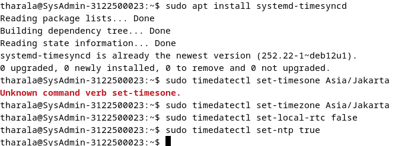 
    <em style="font-size:10px"></em>

- Ubahlah config file timesync.d dengan cara menavigasikan pool ke terdekat supaya delay jadi pendek. Ubahlah line 16 dengan,
``NTP=0.id.pool.ntp.org``

    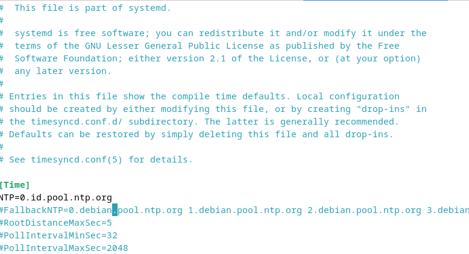 
    <em style="font-size:10px"></em>

- Restart Service yang berjalan dan cek statusnya

    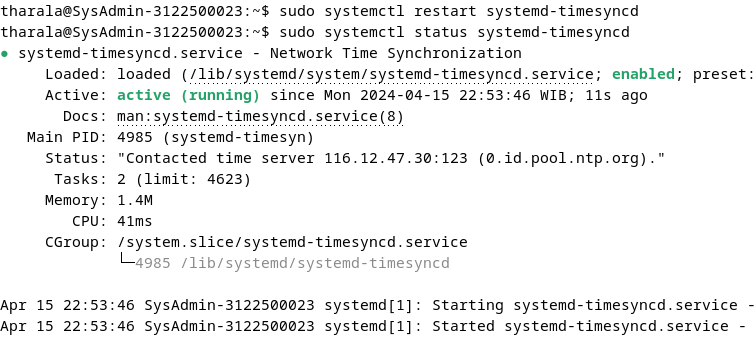 
    <em style="font-size:10px"></em>

- Cek Tanggal

    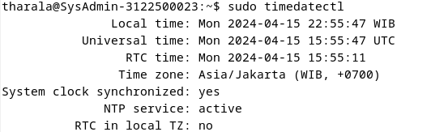 
    <em style="font-size:10px"></em>

## 2. Install WebServer Apache2 (APACHE2 & PHP-FM)
    > APACHE2
- Install paket dengan command berikut ``sudo apt -y install apache2``

    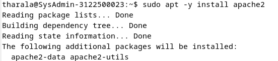 
    <em style="font-size:10px"></em>

- Berikutnya, ubahlah ServerToken Menjadi Prod. Pada line 12 gantilah ``ServerTokens Prod``

    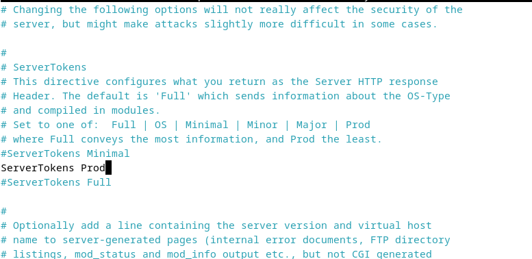 
    <em style="font-size:10px"></em>

- Tambahkan Directory yang dapat diakses

    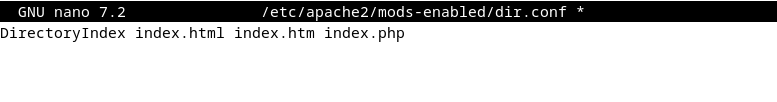 
    <em style="font-size:10px"></em>

- Tambahkan ServerName pada line 70 dengan menuliskan server lebih spesifik, ``wwww.(namakelompok).local``

    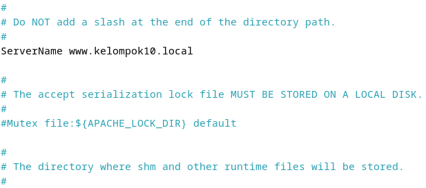 
    <em style="font-size:10px"></em>

- Webmaster email

    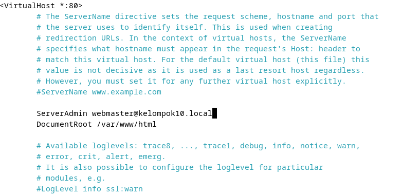 
    <em style="font-size:10px"></em>

- Lakukan reload pada service apache2

    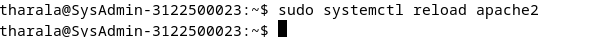 
    <em style="font-size:10px"></em>

- Apakah webserver berjalan pada browser? Mari kita cek!

    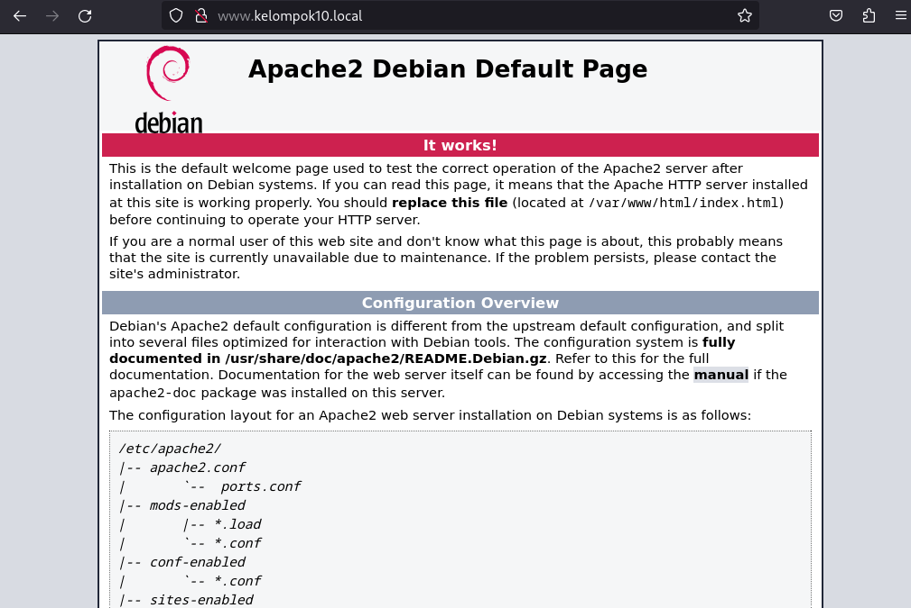 
    <em style="font-size:10px"></em>

    > PHP 8.2
- Install dengan perintah berikut

    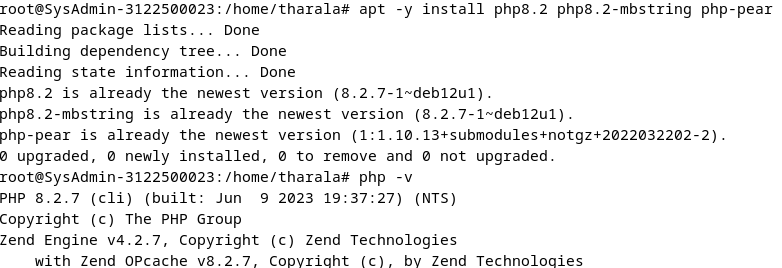 
    <em style="font-size:10px"></em>

- Lakukan pengecekan dan testing apakah sudah berhasil terinstall

    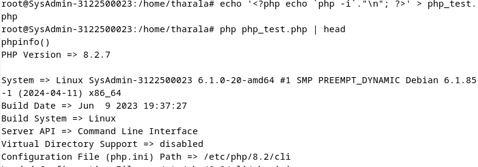 
    <em style="font-size:10px"></em>

    > PHP-FM
- Install dengan perintah berikut

    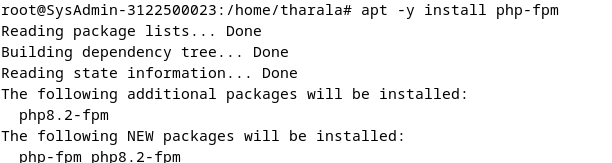 
    <em style="font-size:10px"></em>

- Mengkonfigurasi PHP-FM pada file konfigurasi Apache dengan menambahakan ``<FilesMatch .php$>
SetHandler "proxy:unix:/var/run/php/php8.2-fpm.sock|fcgi://localhost/"``

    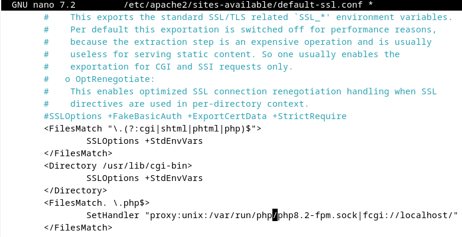 
    <em style="font-size:10px"></em>

- Setenvif pada ae2enmod proxy_fcgi
- Load config
- Jalankan kembali servicenya

    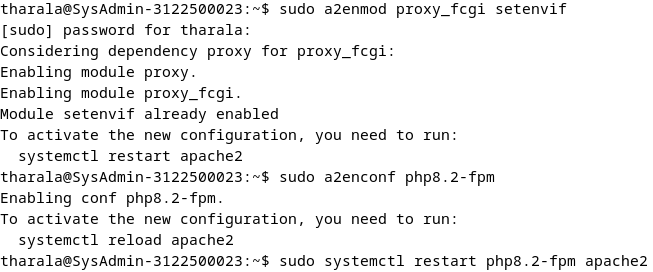 
    <em style="font-size:10px"></em>

- Buatlah file info php untuk mengetes webserver

    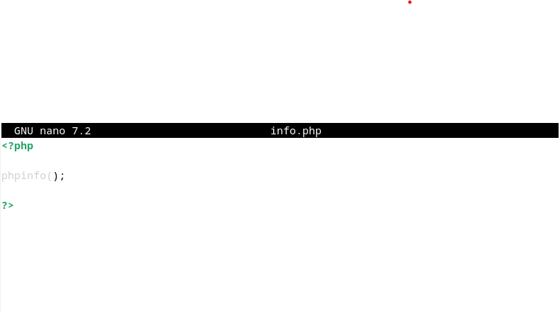 
    <em style="font-size:10px"></em>

- Hasil webservernya

    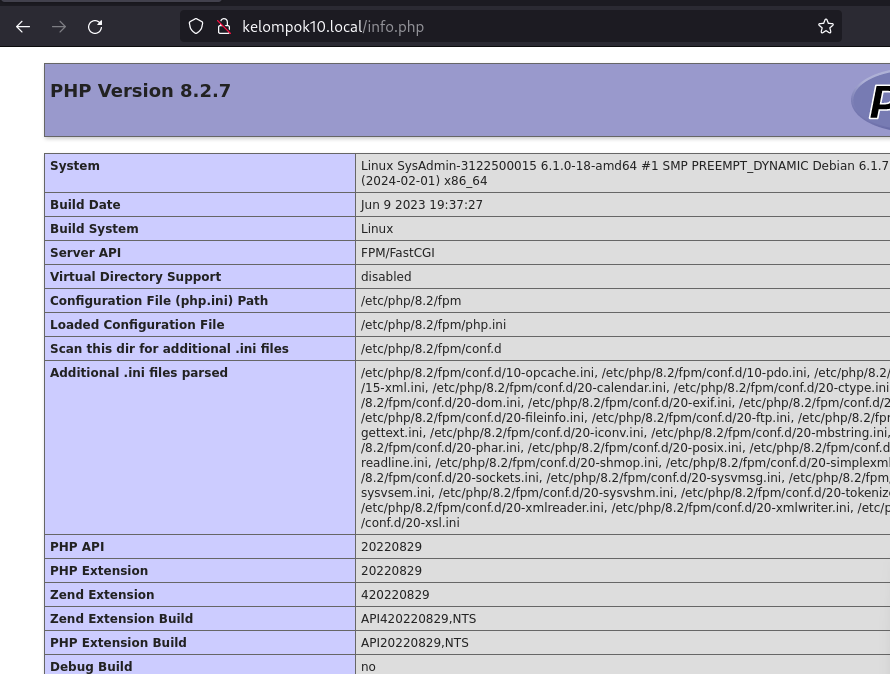 
    <em style="font-size:10px"></em>

## 3. Install Database Server MariaDb
- Install paket dengan perintah berikut

    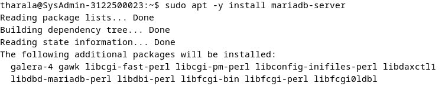 
    <em style="font-size:10px"></em>

- Cek file etc/mysql/mariadb.conf.d/50-server.cnf kemudian pastikan atau ubah charset ke utf8mb4.

    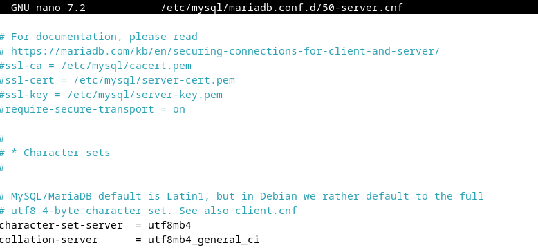 
    <em style="font-size:10px"></em>

Lakukan installasi dengan perintah di bawah ini

    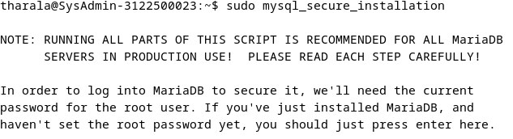 
    <em style="font-size:10px"></em>

    > Instalasi pattern untuk menggunakan MariaDB 
    Enter current password for root (enter for none): Tekan Enter 
    Switch to unix_socket authentication [Y/n] n 
    Change the root password? [Y/n] n 
    Remove anonymous users? [Y/n] y 
    Disallow root login remotely? [Y/n] y 
    Remove test database and access to it? [Y/n] y 
    Reload privilege tables now? [Y/n] y
- Masuk kedalam mysql perintah mysql

    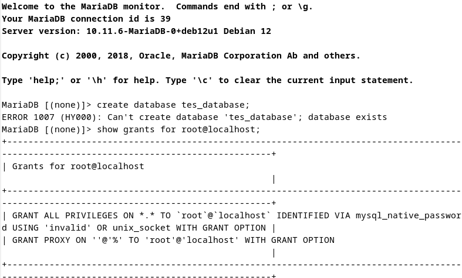 
    <em style="font-size:10px"></em>

    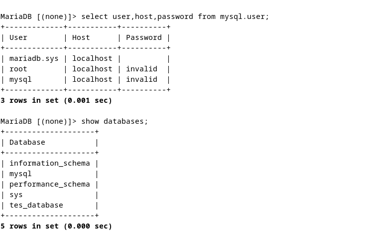 
    <em style="font-size:10px"></em>

    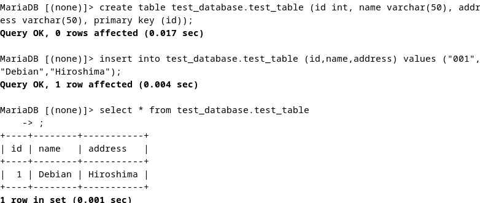 
    <em style="font-size:10px"></em>

## 4. Install SMTP Sever Postfix
- Install dengan perintah 
``sudo nano apt -y install postfix sasl2-bin``
- Pilih opsi No Configuration

    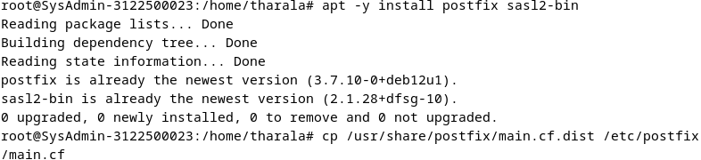 
    <em style="font-size:10px"></em>

- Ubah beberapa Konfigurasi pada file postfix main.cf
    > ``sudo nano /etc/posfix/main.cf``
    - uncomment mail_owner = postfix

    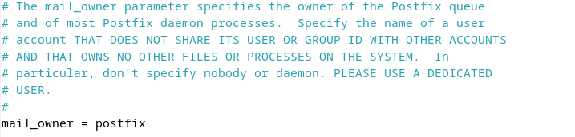 
    <em style="font-size:10px"></em>

    - uncomment and specify hostname myhostname = mail.kelompok10.local

    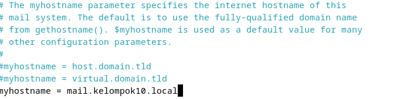 
    <em style="font-size:10px"></em>

    - uncomment and specify domainname mydomain = kelompok10.local

    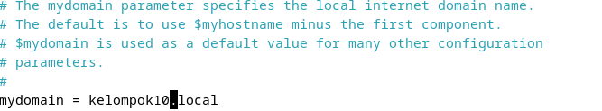 
    <em style="font-size:10px"></em>

    - uncomment myorigin = $mydomain

    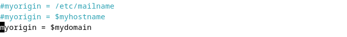 
    <em style="font-size:10px"></em>

    - uncomment inet_interfaces all

    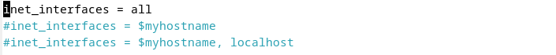 
    <em style="font-size:10px"></em>

    - uncomment mydestination = $myhostname, localhost.$mydomain, localhost, $mydomain

    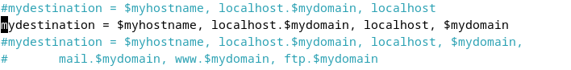 
    <em style="font-size:10px"></em>

    - uncomment local_recipient_maps = unix:passwd.byname $alias_maps

    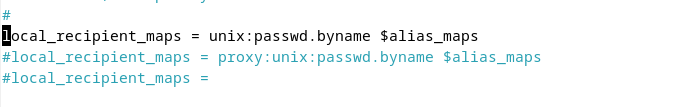 
    <em style="font-size:10px"></em>

    - uncomment mynetworks_style = subnet
    - add your local network mynetworks = 127.0.0.0/8, 10.0.0.0/24, 192.168.0.0/16

    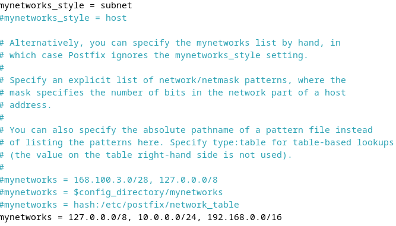 
    <em style="font-size:10px"></em>

    - uncomment alias_maps = hash:/etc/aliases
    - uncomment alias_database = hash:/etc/aliases

    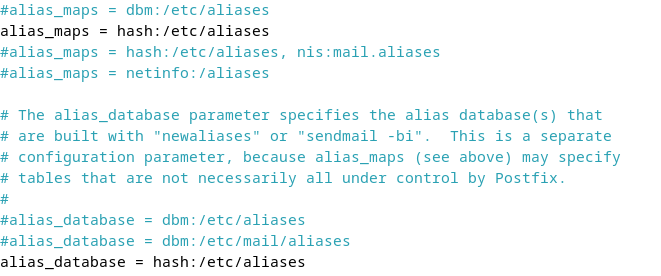 
    <em style="font-size:10px"></em>

    - uncomment home_mailbox = Maildir/
   

    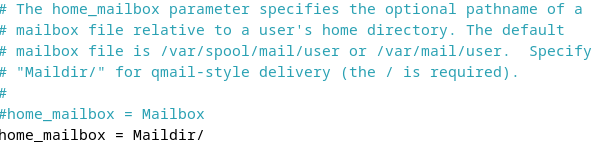 
    <em style="font-size:10px"></em>

    - comment out and add #smtpd_banner = $myhostname ESMTP $mail_name (Debian/GNU)
    smtpd_banner = $myhostname ESMTP

    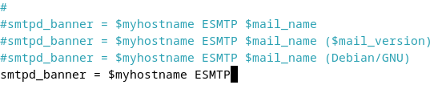 
    <em style="font-size:10px"></em>

    - add sendmail_path = /usr/sbin/postfix
    - add newaliases_path = /usr/bin/newaliases
    - add mailq_path = /usr/bin/mailq
    - add setgid_group = postdrop
    - comment out html_directory =
    - comment out
    #manpage_directory =

    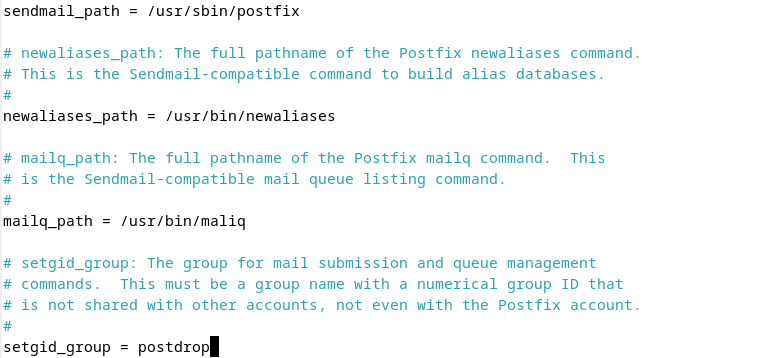 
    <em style="font-size:10px"></em>

    - comment out
    #sample_directory =
    - comment out
    #readme_directory =
    - if also listen IPv6, change to [all] inet_protocols = ipv4
    - #add follows to the end
    - #disable SMTP VRFY command disable_vrfy_command = yes
    - #require HELO command to sender hosts
    - smtpd_helo_required = yes
    - #limit an email size
    - #example below means 10M bytes limit
    - message_size_limit = 10240000
    - #SMTP-Auth settings
    - smtpd_sasl_type = dovecot
    - smtpd_sasl_path = private/auth
    - smtpd_sasl_auth_enable = yes
    -  smtpd_sasl_security_options = noanonymous
    - smtpd_sasl_local_domain = $myhostname
    - smtpd_recipient_restrictions = - permit_mynetworks
    - permit_auth_destination,
    - permit_sasl_authenticated, reject
    

    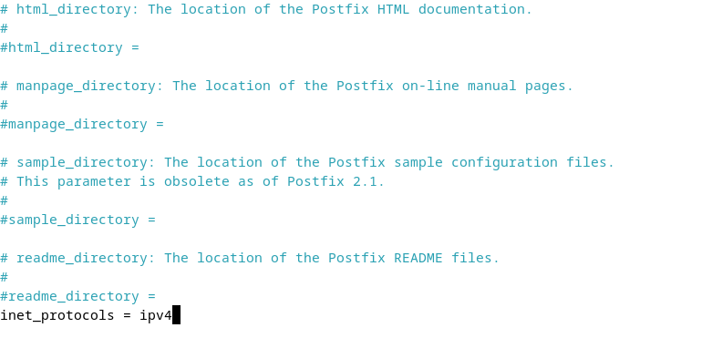 
    <em style="font-size:10px"></em>
    

    

    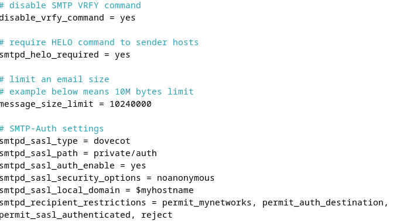 
    <em style="font-size:10px"></em>
    

    

    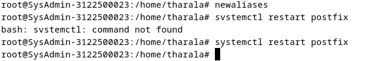 
    <em style="font-size:10px"></em>
    

- Menambahkan konfigurasi anti spam
    > nano /etc/postfix/main.cf 
    #add to the end
    #reject unknown clients that forward lookup and reverse lookup of their hostnames on DNS do not match
    smtpd_client_restrictions = permit_mynetworks, reject_unknown_client_hostname, permit
    #rejects senders that domain name set in FROM are not registered in DNS or not registered with FQDN
    smtpd_sender_restrictions = permit_mynetworks, reject_unknown_sender_domain, reject_non_fqdn_sender
    #reject hosts that domain name set in FROM are not registered in DNS or not registered with FQDN when your SMTP server receives HELO command
    smtpd_helo_restrictions = permit_mynetworks, reject_unknown_hostname, reject_non_fqdn_hostname, reject_invalid_hostname, permit
    

    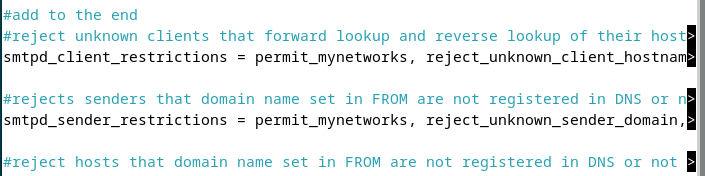 
    <em style="font-size:10px"></em>
    

## 5. Install DOVECOT (IMAP POP3)
- Gunakan Perintah berikut untuk installasi sudo  apt -y install dovecot-core dovecot-pop3d dovecot-imapd
