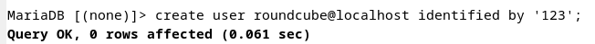

<h1 align="center">LAPORAN WORKSHOP ADMINISTRASI JARINGAN</h1>

<h3 align="center">Dosen Pembimbing: Dr. Ferry Astika Saputra ST, M.Sc</h3>

  <h3>Disusun Oleh:</h3>
  
Masyitha Fahra Nabila 3122500023

  <h3>PROGRAM STUDI TEKNIK INFORMATIKA  
      POLITEKNIK ELEKTRONIKA NEGERI SURABAYA  
      TAHUN 2023/2024  
  </h3>

---
Daftar Isi
- [1. Setup NTP Server](#1-setup-ntp--network-time-protocol)
- [2. Install WebServer Apache2](#2-install-web-server--apache2--php-fm)
- [3. Install Database Server MariaDb](#3-install-database-server--mariadb-server)
- [4. Install SMTP Sever Postfix](#4-install-postfix-mailserver-smtp-server)
- [5. Install IMAP POP3 Dovecot](#5-install-dovecot-imap-pop3)
- [6. Debian Evolution](#6-debian-evolution)
- [7. RoundCube Email Client](#7-roundcube-email-client)

## 1. Setup NTP (Netwotk Time Protocol)
- Gunakan command ``sudo apt install systemd-timesyncd``
- Berikutnya, ubah TimeZone ke Asia/Jakarta
- Setelah mengubah TimeZone, maka ubahlah RTC menjadi sama dengan UTC
- Aktifkan NTP supaya waktu Sinkron.

- Ubahlah config file timesync.d dengan cara menavigasikan pool ke terdekat supaya delay jadi pendek. Ubahlah line 16 dengan,
``NTP=0.id.pool.ntp.org``

- Restart Service yang berjalan dan cek statusnya

- Cek Tanggal

## 2. Install WebServer Apache2 (APACHE2 & PHP-FM)
> APACHE2  
- Install paket dengan command berikut ``sudo apt -y install apache2``

- Berikutnya, ubahlah ServerToken Menjadi Prod. Pada line 12 gantilah   ``ServerTokens Prod``

- Tambahkan Directory yang dapat diakses

- Tambahkan ServerName pada line 70 dengan menuliskan server lebih spesifik, ``wwww.(namakelompok).local``

- Webmaster email

- Lakukan reload pada service apache2

- Apakah webserver berjalan pada browser? Mari kita cek!

> PHP 8.2 
- Install dengan perintah berikut

- Lakukan pengecekan dan testing apakah sudah berhasil terinstall

> PHP-FM 
- Install dengan perintah berikut

- Mengkonfigurasi PHP-FM pada file konfigurasi Apache dengan menambahakan   ``<FilesMatch .php$> SetHandler "proxy:unix:/var/run/php/php8.2-fpm.sock|fcgi://localhost/"``

- Setenvif pada ae2enmod proxy_fcgi
- Load config
- Jalankan kembali servicenya

- Buatlah file info php untuk mengetes webserver

- Hasil webservernya

## 3. Install Database Server MariaDb
- Install paket dengan perintah berikut

- Cek file etc/mysql/mariadb.conf.d/50-server.cnf kemudian pastikan atau ubah charset ke utf8mb4.

- Lakukan installasi dengan perintah di bawah ini

    - Instalasi pattern untuk menggunakan MariaDB 
    - Enter current password for root (enter for none): Tekan Enter 
    - Switch to unix_socket authentication [Y/n] n 
    - Change the root password? [Y/n] n 
    - Remove anonymous users? [Y/n] y 
    - Disallow root login remotely? [Y/n] y 
    - Remove test database and access to it? [Y/n] y 
    - Reload privilege tables now? [Y/n] y
    - Masuk kedalam mysql perintah mysql

## 4. Install SMTP Sever Postfix
- Install dengan perintah 
``sudo nano apt -y install postfix sasl2-bin`` 
- Pilih opsi No Configuration

- Ubah beberapa Konfigurasi pada file postfix main.cf 
    - uncomment mail_owner = postfix
    
    - uncomment and specify hostname myhostname = mail.kelompok10.local
    
    - uncomment and specify domainname mydomain = kelompok10.local
    
    - uncomment myorigin = $mydomain
    
    - uncomment inet_interfaces all
    
    - uncomment mydestination = $myhostname, localhost.$mydomain, localhost, $mydomain
    
    - uncomment local_recipient_maps = unix:passwd.byname $alias_maps
    
    - uncomment mynetworks_style = subnet
    - add your local network mynetworks = 127.0.0.0/8, 10.0.0.0/24, 192.168.0.0/16
    
    - uncomment alias_maps = hash:/etc/aliases
    - uncomment alias_database = hash:/etc/aliases
    
    - uncomment home_mailbox = Maildir/
   
    - comment out and add #smtpd_banner = $myhostname ESMTP $mail_name (Debian/GNU) 
    smtpd_banner = $myhostname ESMTP
    
        - add sendmail_path = /usr/sbin/postfix 
        - add newaliases_path = /usr/bin/newaliases 
        - add mailq_path = /usr/bin/mailq 
        - add setgid_group = postdrop 
        - comment out html_directory = 
        - comment out 
        #manpage_directory =
    
        - comment out 
        #sample_directory = 
        - comment out 
        #readme_directory =
        - if also listen IPv6, change to [all] inet_protocols = ipv4 
        - #add follows to the end 
        -  #disable SMTP VRFY command disable_vrfy_command = yes 
        - #require HELO command to sender hosts 
        - smtpd_helo_required = yes 
        - #limit an email size 
        - #example below means 10M bytes limit 
        - message_size_limit = 10240000 
        - #SMTP-Auth settings 
        - smtpd_sasl_type = dovecot 
        - smtpd_sasl_path = private/auth 
        - smtpd_sasl_auth_enable = yes 
        - smtpd_sasl_security_options = noanonymous 
        - smtpd_sasl_local_domain = $myhostname 
        - smtpd_recipient_restrictions = permit_mynetworks 
        - permit_auth_destination, 
        permit_sasl_authenticated, reject 
    
    
    
- Menambahkan konfigurasi anti spam 
    > nano /etc/postfix/main.cf 
    #add to the end 
    #reject unknown clients that forward lookup and reverse lookup of their hostnames on DNS do not match 
    smtpd_client_restrictions = permit_mynetworks,
    reject_unknown_client_hostname, permit 
    #rejects senders that domain name set in FROM are not registered in DNS or not registered with FQDN 
    smtpd_sender_restrictions = permit_mynetworks, reject_unknown_sender_domain, reject_non_fqdn_sender 
    #reject hosts that domain name set in FROM are not registered in DNS or not registered with FQDN when your SMTP server receives HELO command 
    smtpd_helo_restrictions = permit_mynetworks, reject_unknown_hostname, reject_non_fqdn_hostname, reject_invalid_hostname, permit 
    

## 5. Install DOVECOT (IMAP POP3)
- Gunakan Perintah berikut untuk installasi ``sudo  apt -y install dovecot-core dovecot-pop3d dovecot-imapd``

- Ubah listen IP dengan beberapa command di bawah ini:
    - nano /etc/dovecot/dovecot.conf 
    #line 30 : uncomment  
    listen = *, ::
    
    - nano /etc/dovecot/conf.d/10-auth.conf 
    #line 10 : uncomment and change (allow plain text auth) 
    disable_plaintext_auth = no
    
    #line 100 : add 
    auth_mechanisms = plain login
    
    - nano /etc/dovecot/conf.d/10-mail.conf  
    #line 30 : change to Maildir 
    mail_location = maildir:~/Maildir
    
    - nano /etc/dovecot/conf.d/10-master.conf 
    #line 107-109 : uncomment and add 
    #Postfix smtp-auth 
    unix_listener /var/spool/postfix/private/auth {  
    mode = 0666  
    user = postfix  
    group = postfix}
    
    - systemctl restart dovecot
- ``netstat -a| grep LISTEN`` 
Akan terlihat hasilnya seperti di bawah, dengan status Server (LISTEN) : MariaDB(MySQL), IMAP,POP3, DNS(domain), IMAPS, POP3S, Postfix (SMTP)

- Lakukan test connection ke postfix dengan perintah ``telnet mail.kelompok2.local``

> Instal phpMyAdmin

> Lakukan konfigurasi PHP MyAdmin pada Apache2

> Create user dengan password (123)

> sudo systemctl restart mariadb  
> sudo systectl restart php8.2-fpm apache2
> Cek pada browser apakah login berhadil dilakukan?

## 6. Debian Evolution
- Buat User Terlebih  yaitu tharala

- Buat user lagi (dummy)  dengan langkah yang sama, ``adduser`` terlebih dahulu

- Mengirim pesan

- Terdapat email dari user dan budi yang kita lakukan maka berhasil

## 7. RoundCube Email Client
- Lakukan konfigurasi untuk user  roundcube, tambahkan pada tabel db user

- Install Roundcube paket dengan command   ``sudo apt-get install roundcube -y``
- Lakukan config

- Lakukan config file apache pada roundcube, uncomment line 3 dan hapus public_html path.

- Lakukan symlink pada folder roundcube ke folder dimana aplikasi ini dionline kan
- Tambahkan Servername dan DocumentRoot pada file:

- Lakukan rekonfigurasi
    - sudo dpkg-reconfigure roundcube-core

- Lakukan pengecekan roundcube 

- Lakukan percobaan untuk mengirim pesan ke user lain.

- Lakukan pengecekan pesan masuk pada user kedua 

- Pesan berhasil masuk dan diterima oleh user kedua. Roundcube berhasil berjalan dengan baik.